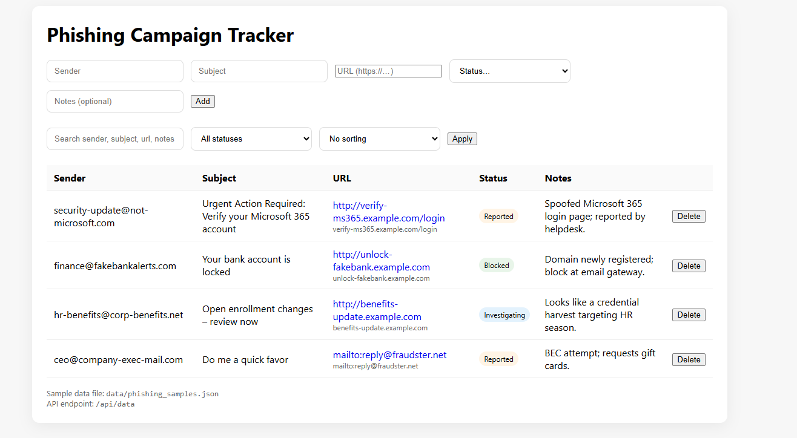

# Phishing Campaign Tracker

A minimal **Flask** web app to record, search, sort, and manage suspected phishing messages.  
This project demonstrates practical **SOC/Incident Response** skills: tracking incidents, triaging with search/filter, and keeping a lightweight audit of actions.

---

## Features
- Add: sender, subject, URL, status, notes
- View/Search: search across any field; filter by status
- Sort: by sender, subject, or status
- Delete: remove an entry (persists in the JSON file)
- API: `GET /api/data` returns all records as JSON

---

## Tech Stack
- **Backend**: Python 3, Flask
- **Frontend**: HTML + minimal CSS
- **Storage**: JSON file (`data/phishing_samples.json`)

---

## How it works
- **Routes**:
  - `GET /` → render table with search/filter/sort
  - `POST /add` → append a new record
  - `POST /delete/<id>` → remove a record by ID
  - `GET /api/data` → return the data as JSON
- **Template**: `templates/index.html` (Jinja2)
- **Persistence**: `data/phishing_samples.json`

---

## Project Structure
```
phishing-campaign-tracker/
├── app.py
├── requirements.txt
├── data/
│ └── phishing_samples.json
├── templates/
│ └── index.html
├── static/
│ └── styles.css
└── README.md
```


---

## How to Run Locally
```bash
python -m venv venv
venv\Scripts\activate
pip install -r requirements.txt
python app.py
Open: http://127.0.0.1:5000/

## Example UI
Below is an example of the Phishing Campaign Tracker interface in action:



